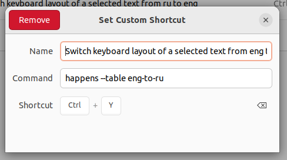

### `happens`

A keyboard layout switcher. Just highlight the text and press a preconfigured
hotkey to switch the layout.


### Installation

1. Install `xdotool`:

```
sudo apt install xdotool
```

2. Grab the binary from releases and put it in any folder that is visible in
`$PATH`.

3. [Bind the binary to a hotkey](https://help.ubuntu.com/stable/ubuntu-help/keyboard-shortcuts-set.html.en) in your desktop environment. Note the `--table`
argument. Courrently, the only supported tables are `eng-to-ru` and `ru-to-eng`
but new ones are coming.


