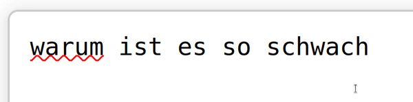

### `happens`

A keyboard layout switcher. Just highlight the text and press a preconfigured
hotkey to switch the layout.

### Installation

1. Install `xdotool`:

```
sudo apt install xdotool
```

2. Grab the binary from releases and put it in any folder that is visible in
`$PATH`.

> **Note:**
>
> If there is no  pre-built binary for your platform, you may build it
> yourself from source like this (Rust tooling is required):

```
git clone https://github.com/v-spassky/happens.git
```

```
cd happens
```

```
cargo build --release
```

```
cp target/release/happens ~/.local/bin/
```

```
chmod u+x ~/.local/bin/happens
```

3. [Bind the binary to a hotkey](https://help.ubuntu.com/stable/ubuntu-help/keyboard-shortcuts-set.html.en)
in your desktop environment.


You may set up the binding in two distinct modes:

##### Using one of the precompiled tables:

```
happens --table [ru-to-eng | eng-to-ru]
```

Example:

```
happens --table ru-to-eng
```

With such configuration, the program will work like this:


##### Using your own custom table:

```
happens --from-file /<...>/table.txt
```

In this case, the `table.txt` file should be formatted as follows:

```
<key1_before>: <key1_after>
<key2_before>: <key2_after>
...
<keyN_before>: <keyN_after>
```

Example:

```
a: R
s: R
d: R
f: R
g: R
```

With the configuration above using the custom table shown above, the program
will work like this:



### Development notes

To set up the program up and running, first set up a hotkey binding to call
such command:

```
happens --from-file /<...>/happens/samples/custom_table.txt --logfile-name /<...>/happens/logs.txt
```

Alternatively, if you want to use the a precompiled table:

```
happens --table [ru-to-eng | eng-to-ru] --logfile-name /<...>/happens/logs.txt
```

Then, copy the binary from project folder to a folder, visible in `$PATH`
and make it executable:

```
cargo build
```

```
cp target/debug/happens ~/.local/bin/
```

```
chmod u+x ~/.local/bin/happens
```

Or, as a shortcut:

```
cargo build && cp target/debug/happens ~/.local/bin/ && chmod u+x ~/.local/bin/happens
```

It is also possible to run the program via a terminal like this:

```
cargo run -- --from-file /<...>/happens/samples/custom_table.txt
```